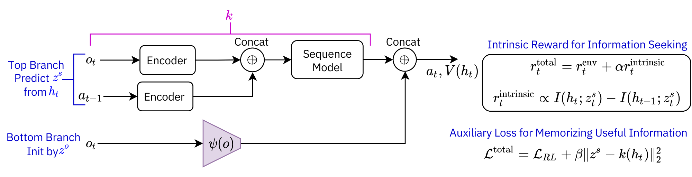
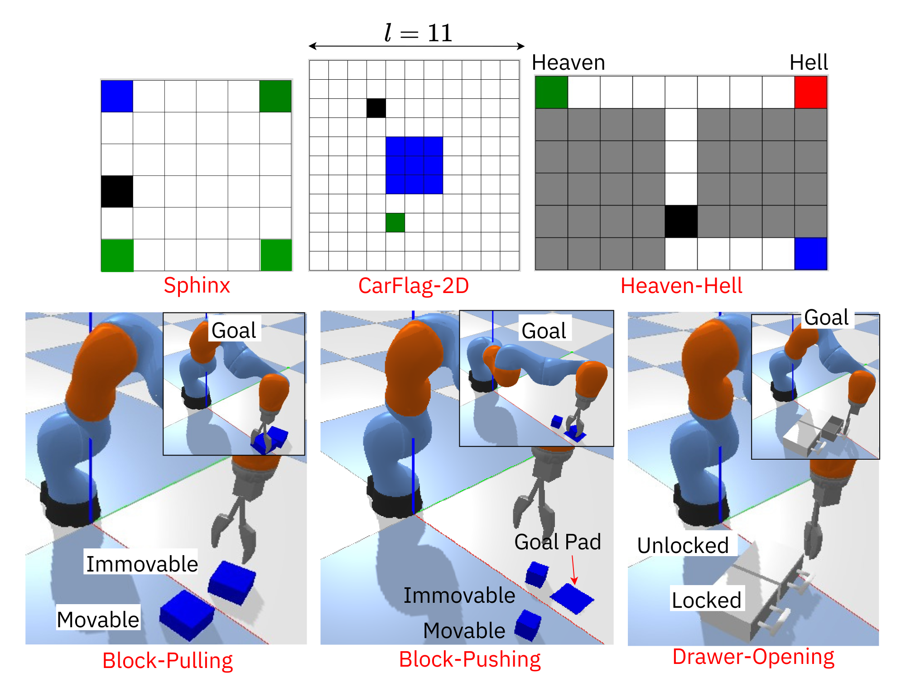

# Leveraging Mutual Information for Asymmetric Learning under Partial Observability
[Paper](https://openreview.net/pdf?id=9jJP2J1oBP)&nbsp;&nbsp;&nbsp;&nbsp;&nbsp;&nbsp;&nbsp;&nbsp;[Site](https://sites.google.com/view/mi-asym-pomdp)  

This paper proposes using state-observation and state-history mutual information to improve the agent's architecture and ability to seek information and memorize efficiently through intrinsic rewards and an auxiliary task in POMDPs



## Installation
1. Clone the repository
```bash
git clone https://github.com/hai-h-nguyen/mi-asym-pomdp.git
cd mi-asym-pomdp
```
2. Create and activate the environment
```bash
conda create -n mi-asym-pomdp python=3.8
conda activate mi-asym-pomdp
```

3. Install the requirements
```bash
pip install -r requirements.txt
```

4. Install PyTorch
```bash
pip install torch==1.13.1+cu117 torchvision==0.14.1+cu117 torchaudio==0.13.1 --extra-index-url https://download.pytorch.org/whl/cu117
```
## Domains



## Running the code
## 1. Collecting Offline Data for Learning Representations

### Parameters:
- **env_name**: Name of the environment to collect data from. Possible values: `[sphinx, carflag_2d, heaven_hell, block_pulling, block_pushing, heaven_hell]`
- **episodes**: Number of episodes to collect data.
- **random_episodes**: Number of random episodes to collect data.
- **aug**: Whether to use data augmentation (applicable to the `Robot` domain).
- **n_aug**: Number of augmentations to apply (applicable to the `Robot` domain).

---

### 1.1 For the `GridWorld` Domain
Run the following command:
```bash
python3 main_collect_data.py --config_env configs/envs/<env_name>.py --episodes <episodes> --random_episodes <random_episodes>
```

### 1.2. For the `Robot` domain
```bash
python3 main_collect_data.py --config_env configs/envs/<env_name>.py --episodes <episodes> --random_episodes <random_episodes> --aug --n_aug <n_aug>
```

## 2. Learning Task-Relevant and Non-Overlapping State and Observation Features
### Parameters:
- **data_path**: Path to the data file collected in the previous step.
- **config_env**: Path to the environment configuration file. **configs/envs/<env_name>.py**
- **config_repr**: Path to the representation learning configuration file. **configs/repr/<env_name>.py**
- **num_epochs**: Number of epochs to train the model.
- **seed**: Random seed for reproducibility.
- **cuda**: GPU ID for training.
- **log_freq**: Frequency of logging training progress.
- **wandb**: Whether to use Weights & Biases for logging.
- **wandb_name**: Name of the Weights & Biases run.
- **init_model**: Path to the initial model checkpoint.

```bash
python3 main_pretrain_representations_cv_mim.py --data_path <data_path> --config_env configs/envs/<env_name>.py --config_repr configs/repr/<env_name>.py --num_epochs <num_epochs> --seed <seed> --cuda <cuda> --log_freq <log_freq> --wandb --wandb_name <wandb_name> --init_model <init_model>
```
## 3. Learning a Policy
### Parameters:
- **config_env**: Path to the environment configuration file. **configs/envs/<env_name>.py**
- **config_rl**: Path to the reinforcement learning configuration file. **configs/rl/<rl_name>.py**
- **config_seq**: Path to the sequence learning configuration file. **configs/seq/<seq_name>.py**
- **config_repr**: Path to the representation learning configuration file. **configs/repr/<repr_name>.py**
- **state_embedder_dir**: Path to the directory containing the state embedder model.
- **obs_embedder_dir**: Path to the directory containing the observation embedder model.
- **group**: Wandb group name.
- **train_episodes**: Number of training episodes.

```bash
python3 main.py --config_env configs/envs/<env_name>.py --config_rl configs/rl/<rl_name>.py --config_seq configs/seq/<seq_name>.py --config_repr configs/repr/<repr_name>.py --state_embedder_dir <state_embedder_dir> --obs_embedder_dir <obs_embedder_dir> --group <group> --train_episodes <train_episodes>
```

## Acknowledgement

The code is largely based on prior works:
- [POMDP Baselines](https://github.com/twni2016/pomdp-baselines)
- [Memory-RL](https://github.com/twni2016/Memory-RL)

## Citation
```
@inproceedings{nguyen2024leveraging,
  title={Leveraging Mutual Information for Asymmetric Learning under Partial Observability},
  author={Nguyen, Hai Huu and Amato, Christopher and Platt, Robert and others},
  booktitle={8th Annual Conference on Robot Learning}
}
```
